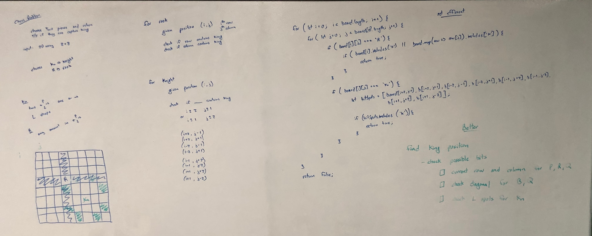

# Chess Check

## Challenge

Check if a given chess board (given as a 2D Array) is in a check state.

## Approach & Efficiency

Find position of king and check if possible locations of "attackers" are occupied.

Since the input is constrained, the time and space efficieny is `O(1)`.

## Solution

