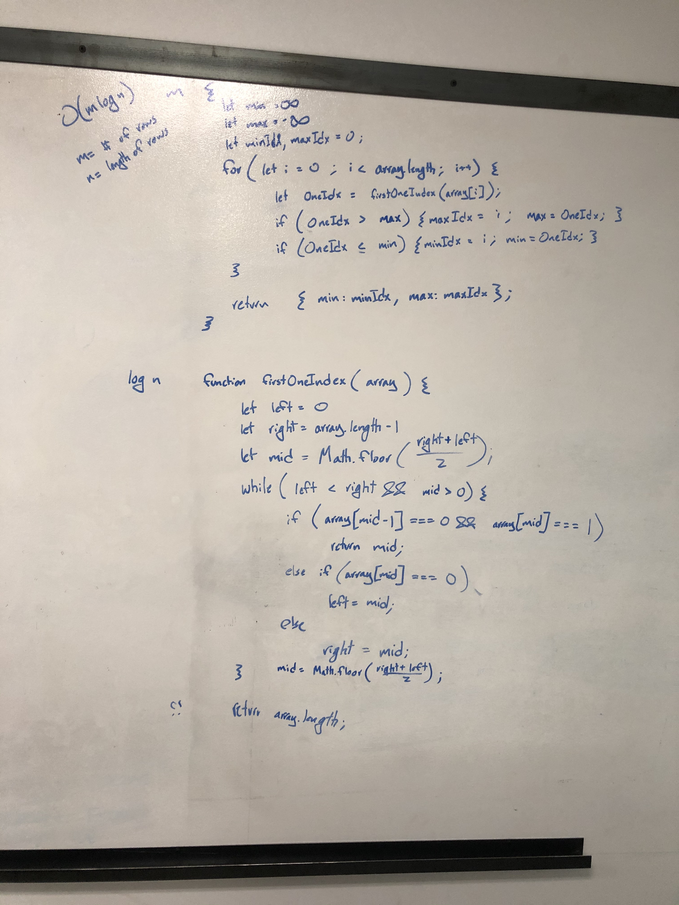

# Max and Min Zero Rows in Matrix of Sorted Rows

## Challenge

Given a 2D array where the rows are sorted and contain only 0 and 1. Return the index of the row with the biggest amount of zeroes, and the index of the row with the biggest amount of zeroes.

## Approach & Efficiency

Loop through rows of the matrix and perform binary search on individual rows to get the index of the first 1 to occur.

Analysis:

Time: `O(m * log(n))`, m is the number of rows and n is the length of the rows
Space: `O(1)`

## Solution

