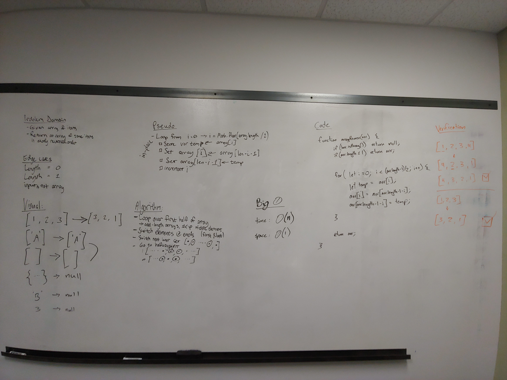

# Reverse an Array

Given an array as input, reverse the order of the values in the array.

## Challenge

Write a function called reverseArray which takes an array as an argument. Without utilizing any of the built-in methods available to your language, return an array with elements in reversed order.

## Approach & Efficiency

### Method A
Using a for loop, iterated over the first half of the array and swapped the values with their mirror values from the second half of the array.

It runs in O(n) time and O(1) space, which is the best possible solution for this challenge.

### Method B
Create a new array and add values of inputted array to new array, starting from the end.

Time: O(n) where n is the length of the input array
Space: O(n) where n is the length of the input array

Pro: Can get the reverse array without changing the original.
Con: Not great if space is restricted.

## Solution

