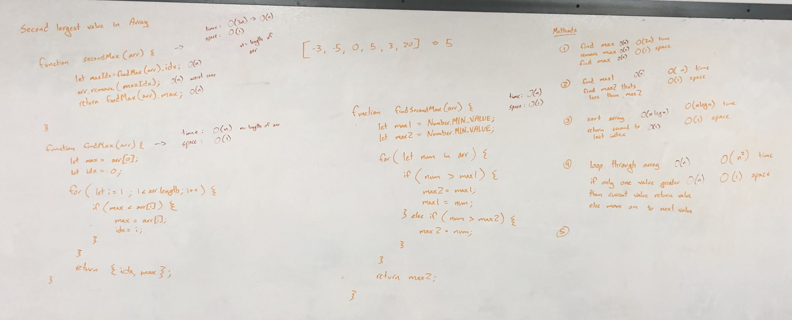

# Second Largest Value in an Array

Given an array as input, return the second largest value in array. If the array has only 1 or less values, return null.

## Challenge

Write three functions that find the second largest value in an array and return the value. If the array has only 1 or less values, return null.

Choose the most optimal function out of the three and explain why it's the most optimal one out of the three.

## Approach & Efficiency

### Method A -------- Most Optimal Solution --------
1. Loop through the array and keep track of the largest and second largest values in array. 
2. Return the second largest.

Pro: 

- true O(n) time complexity (n = length of array), only loop through array once
- O(1) space complexity, no storage that scales with input size

Con:

- Can't think of any, this is the best you can get with an unsorted array.

### Method B
1. Find the max value in array. 
2. Delete the value from the array.
3. Find the max value in array.

Pro:

- O(3n) time complexity => O(n) where n is the length of the array
- O(1) space complexity, no storage that scales with input size.

Con:

- Loops through entire array 3 times in worst case scenario
  - Once to find max value
  - Once to delete max value and shift values to new indexes
  - Once to find max value again 

### Method C
1. Sort the array
2. Return the second to last value in sorted array

Pro:

- O(1) space complexity

Con:

- O(n^2) time complexity, due to time complexity for sorting with built in array methods in JavaScript

## Solution

~~~javascript
/**
 * Returns the second largest value in an array
 * If array is empty or has less than 2 values, returns null;
 * @param {Array} arr 
 * @returns {Number|null} second largest value in array 
 */
function findSecondMax1(arr) {
  if (arr.length <= 1) return null;

  let max1 = arr[0];
  let max2 = arr[0];

  for (let i = 1; i < arr.length; i++) {
    if (arr[i] > max1) {
      max2 = max1;
      max1 = arr[i];
    } else if (arr[i]  > max2) {
      max2 = arr[i];
    }
  }
  return max2;
}
~~~

