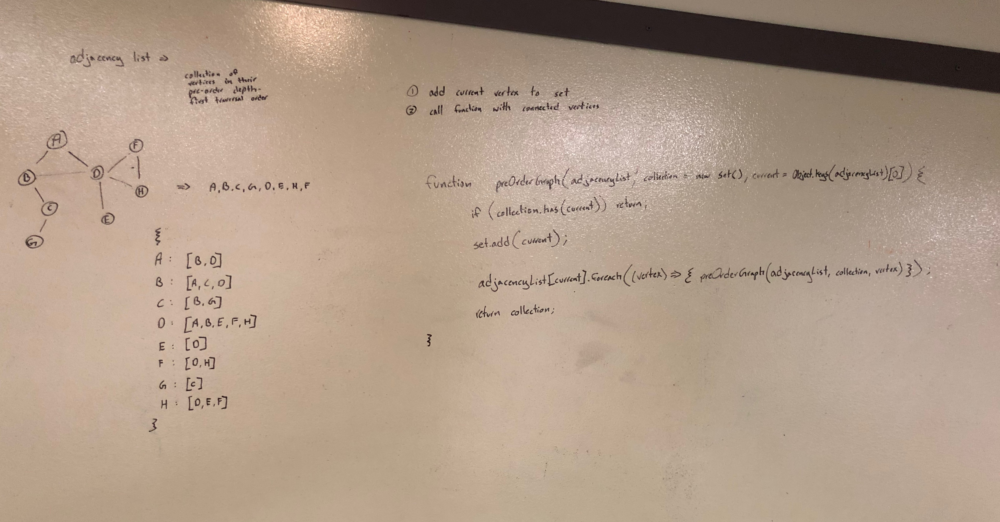

# Depth First Preorder Graph Traversal

## Challenge

Create a function that accepts an adjacency list as a graph, and conducts a depth first traversal. Without utilizing any of the built-in methods available to your language, return a collection of vertices in their pre-order depth-first traversal order.

## Approach & Efficiency

Use recursion to traverse the graph, add vertices to the collection as they are traversed. Once added, traverse the neighbors as well.

Time: `O(n)`, n = number of vertices

Space: `O(n)`, n = number of vertices

## Solution

