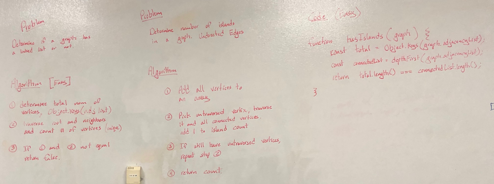

# Check if Graph has islands

## Challenge

Given a graph. Determine if there are islands in the graph.

## Approach & Efficiency

Use `Object.keys(adjacencyList)` to get array of all vertices in the graph.

Use depth-first traversal to get a collection of traversed vertices. If no islands, all vertices should have been traversed.

Check if lengths of these two lists is the same, if not there must be at least one island in the graph.

Time: `O(n)`, n = number of vertices

Space: `O(n)`, n = number of vertices

## Solution

