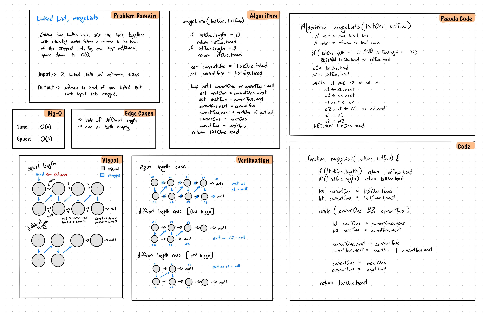

# Linked List Merge Challenge

## Challenge Description

Write a function called `mergeLists` which takes two linked lists as arguments. Zip the two linked lists together into one so that the nodes alternate between the two lists and return a reference to the head of the zipped list. Try and keey additional space down to O(1).

## Approach & Efficiency

Due to the restriction of O(1) space complexity, went with a solution that does the merge in-place. However this does have the draw back of wreaking the input lists.

The algorithm used takes the head pointer from the first passed in list and adds the nodes from the other list in every other spot, this process insures O(1) space complexity since we are not making a new linked list.

Time: O(n)
Space: O(1)

## Solution

~~~~javascript
function mergeLists(listOne, listTwo) {
  // no lists given
  if (!listOne && !listTwo) return null;

  // if one of the lists is empty/not passed, return the other head reference
  if (!listOne || !listOne.length) return listTwo.head;
  if (!listTwo || !listTwo.length) return listOne.head;

  let currentOne = listOne.head;
  let currentTwo = listTwo.head;

  while (currentOne && currentTwo) {
    let nextOne = currentOne.next;
    let nextTwo = currentTwo.next;

    currentOne.next = currentTwo;
    currentTwo.next = nextOne || currentTwo.next;

    currentOne = nextOne;
    currentTwo = nextTwo;
  }

  return listOne.head;
}
~~~~