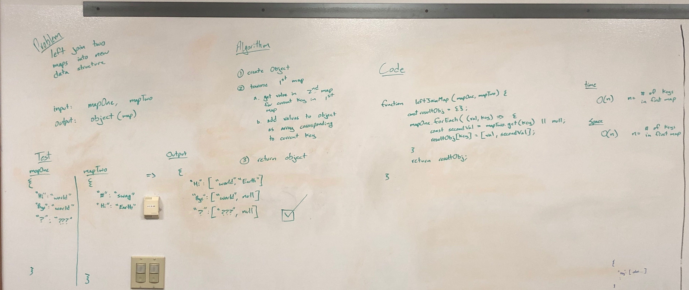

# Left Join Maps Challenge

Left join (SQL) two maps with keys and values of type string.

## Challenge Description

Write a function that LEFT JOINs two hashmaps into a single data structure.

- The first parameter is a hashmap that has word strings as keys, and a synonym of the key as values.
- The second parameter is a hashmap that has word strings as keys, and antonyms of the key as values.
- Combine the key and corresponding values (if they exist) into a new data structure according to LEFT JOIN logic.
- LEFT JOIN means all the values in the first hashmap are returned, and if values exist in the “right” hashmap, they are appended to the result row. If no values exist in the right hashmap, then some flavor of NULL should be appended to the result row.
- The returned data structure that holds the results is up to you. It doesn’t need to exactly match the output below, so long as it achieves the LEFT JOIN logic.
- Avoid utilizing any of the library methods available to your language.

## Approach & Efficiency

Created a new structure for the join since

Traverse keys of first map and add first map's and second map's value for each key into an object.

Return object at the end of the traversal.

`Time Complexity`: O(n), n => number of keys in first map

`Space Complexity`: O(n), n => number of keys in first map

## Solution



```js
function leftJoinMap(mapOne, mapTwo) {
  const resultObj = {};
  mapOne.forEach((val, key) => {
    const secondVal = mapTwo.get(key) || null;
    resultObj[key] = [val, secondVal];
  });
  return resultObj;
}
```
