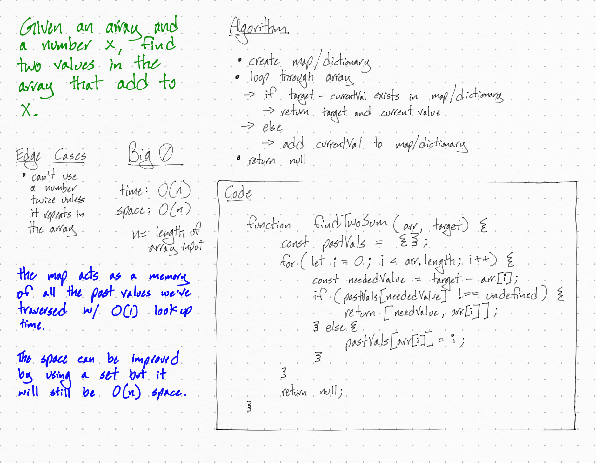

# Two Sum Challenge

## Challenge Description

Given an array of integers and a value, find a pair of integers in the array that add to that value.

## Approach & Efficiency

Traverse through the array, if (value - currentArrayValue) was previously traversed, return that value and the currentArrayValue.

Use a JavaScript object as a 'Map' to keep track of values I've traversed in the array.

- O(1) look up time

`Time Complexity`: O(n), n => length of array

`Space Complexity`: O(n), n => length of array

## Solution



```js
findTwoSum(arr, value) {
  if (!Array.isArray(arr) || typeof value !== 'number') return null;

  const pastVals = {};
  for (let i = 0; i < arr.length; i++) {
    const neededValue = value - arr[i];
    if (neededValue in pastVals) {
      return [neededValue, arr[i]];
    } else {
      pastVals[arr[i]] = i;
    }
  }
  return null;
};
```
