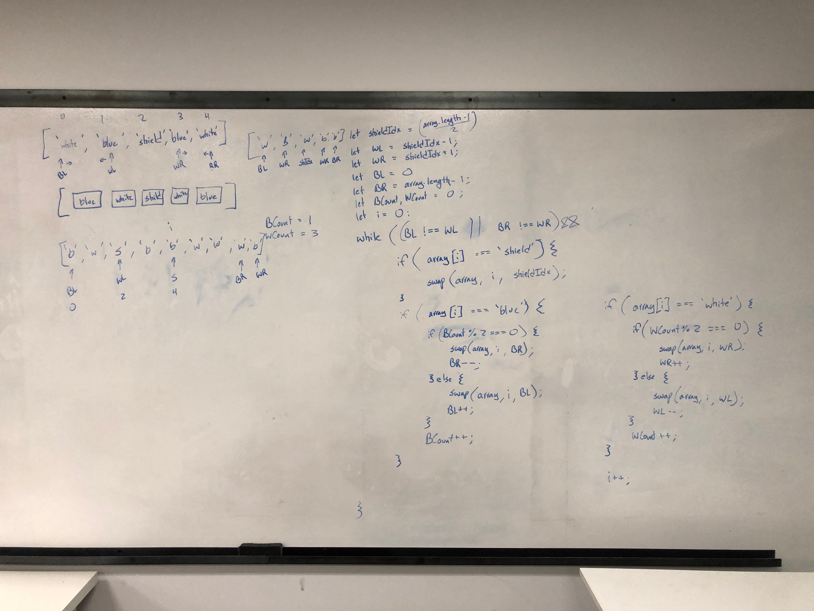

# El Salvador Flag Sort Challenge

## Challenge Description

Input = [] contains either:

- 'b' => even amount
- 'w' => even amount
- 's'

arrange the array so ['b', 'w', 's', 'w', 'b']

## Approach & Efficiency

Use quick sort method to swap as you iterate through the array.

Time complexity is `O(n)` where n is the length of the array.

Space complexity is `O(1)` since constant variables created.

## Solution

