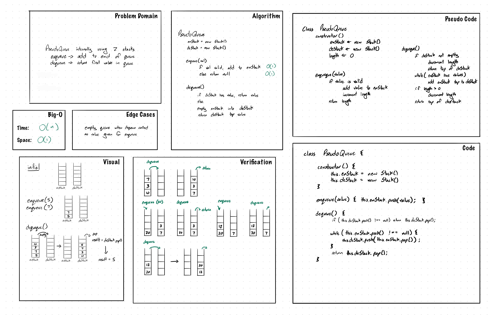

# Challenge Summary

`Queue`: First in first out data structure, only have access to front and back of list.

`Stack`: Last in first out data structure, only have access to one end of list.

## Challenge Description

Create a brand new PseudoQueue class. Do not use an existing Queue. Instead, this PseudoQueue class will implement our standard queue interface (the two methods listed below), but will internally only utilize 2 Stack objects. Ensure that you create your class with the following methods:

- `enqueue(value)` which inserts value into the PseudoQueue, using a first-in, first-out approach.
- `dequeue()` which extracts a value from the PseudoQueue, using a first-in, first-out approach.

## Approach & Efficiency

Used approach with one stack for enqueue and one for dequeue. When enqueue(value) is called the value is inserted into enqueue stack and when dequeue is called, the values from the enqueue stack are emptied into the dequeue stack.

This approach has O(1) time complexity for enqueue and work case O(n) for dequeue. On average, the time complexity for dequeue is O(1) if the dequeue stack already has values in it.

## Solution

