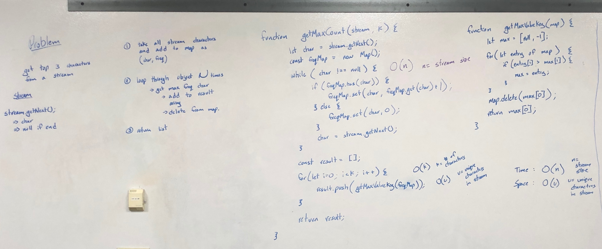

# K most frequent values in Stream

## Challenge

Given a stream and k value, return the k most frequent values in the stream.

## Approach & Efficiency

Iterate through the entire stream and count the frequency of each value using a map. From the map, return the k most frequent values.

Time: `O(n)`, n = number of values in stream

Space: `O(n)`, n = number of values in stream

## Solution

