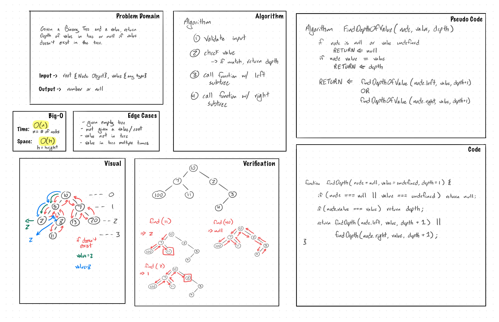

# Challenge Summary

A binary tree is a data structure containing nodes linked together with left and right pointers. Each Node has 
properties `value`, `left` and `right`. The tree itself has only one property called `root`, from which all other 
nodes branch.  

## Challenge Description

Given a root node and a value, return the depth of the value in the tree. You can return the depth of the first value
 you find, you don't need to return the smallest or largest depth.

## Approach & Efficiency

Used pre-order recursive traversal to search through the nodes with a carried depth count.
This approach has time complexity of `O(n)` since the function traverses through the tree until the value is found or
 all nodes are traversed.

## Solution

Code:
~~~javascript
function findDepthOfValue(node=null, value=undefined, depth=0) {
    if (node === null || value === undefined) return null;
    if (node.value === value) return depth;
    const leftCheck = findDepthOfValue(node.left, value, depth + 1);
    const rightCheck = findDepthOfValue(node.right, value, depth + 1);
    return leftCheck || rightCheck;
}
~~~