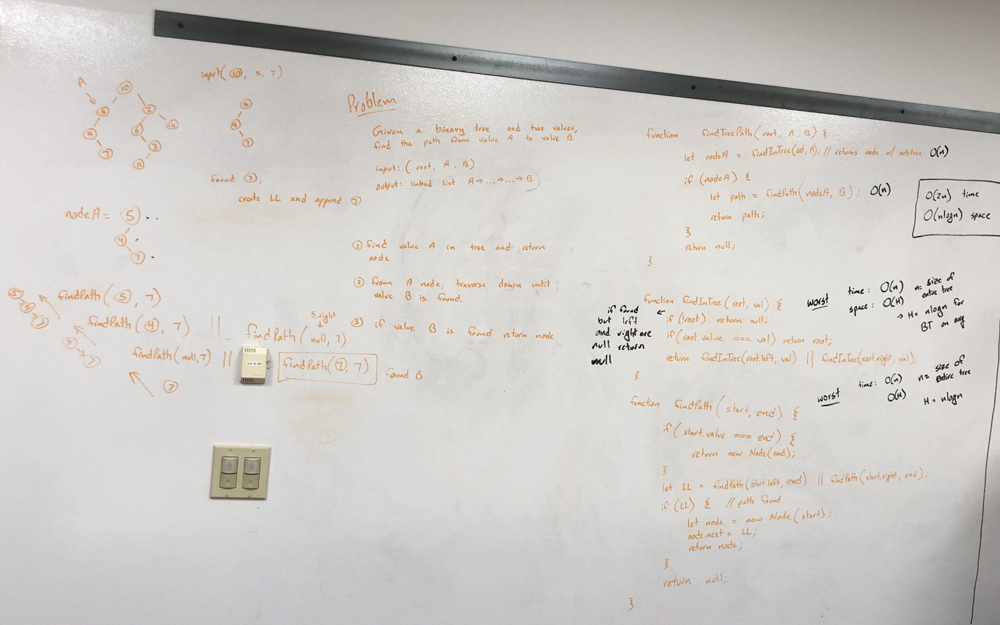

# Find Path between Nodes of Binary Tree

A node is a data structure that contains a value and pointers to other nodes.

- A singly linked list node will have a value and a single pointer to the next node in the linked list.

- A binary tree node has a value and two pointers, one to the left child node and one to the right child node.

A binary tree is a data structure of nodes where each node has at most 2 child nodes.

## Challenge

Given a Binary tree and two values (A and B). Return a linked list representing the Path from A to B.

## Approach & Efficiency

Used the recursive bottom up approach:

1. Find the node with value A.
2. Find the node with value B from the subtree of node A.
3. If B is found, return node with value equal to B.
4. As the B node travels up the recursive chain, each node adds on to the B node to create a linked list.
5. Once node A is reached, return the linked list.

Big O Analysis:

Time: `O(n)`

- n = number of nodes in tree
- worst case look through entire tree to find A and B when they don't exist

Space: `O(H)`,

- where H = the height of the tree, which on average is `n*log(n)`
- recursive calls from root of tree to lowest leaf node so space use in O(H)
- also if path is path is from root to lowest leaf, linked list will be of size H

## Whiteboard

