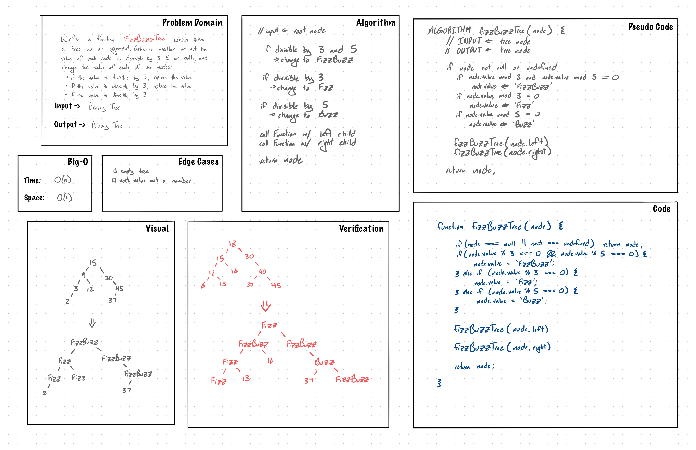

# Challenge Summary

FizzBuzz challenge with Binary Tree.

## Challenge Description

Write a function called `FizzBuzzTree` which takes a tree as an argument.
Determine weather or not the value of each node is divisible by 3, 5, or 
both, and change the value of each of the nodes:
- if the value is divisible by 3, replace the value with 'Fizz'
- if the value is divisible by 5, replace the value with 'Buzz'
- if the value is divisible by 3 and 5, replace the value with 'FizzBuzz'

Return the tree with its new values.

## Approach & Efficiency
Used recursion to pre-order traverse the tree and check each individual node value.
This approach has time complexity `O(n)` where n is the number of nodes in the tree.
The space complexity is `O(1)` since these checks and value changes are done in-place.

## Solution

~~~javascript
function fizzBuzzTree(node) {
  if (node === null) return node;
  if (node.value % 3 === 0 && node.value % 5 === 0) {
    node.value = 'FizzBuzz';
  } else if (node.value % 3 === 0) {
    node.value = 'Fizz';
  } else if (node.value % 5 === 0) {
    node.value = 'Buzz';
  }
  fizzBuzzTree(node.left);
  fizzBuzzTree(node.right);
  return node;
}
~~~