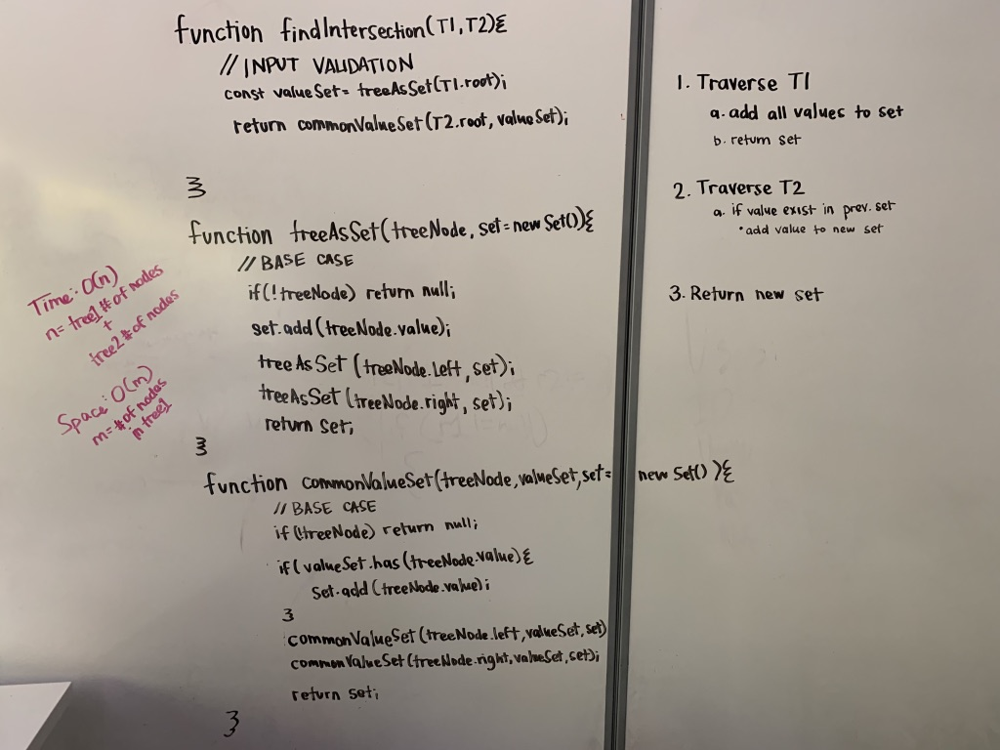

# Challenge Summary

## Challenge Description

## Approach & Efficiency

## Solution



```javascript
function treeIntersection(treeOne, treeTwo) => {
  if (!treeOne || !treeTwo || !treeOne.root || !treeTwo.root) return null;
  const valueSet = treeAsSet(treeOne.root);
  return commonValueSet(treeTwo.root, valueSet);
};

function treeAsSet(treeNode, set) {
  if (!treeNode) return null;
  if (set === undefined) {
    set = new Set();
  }
  set.add(treeNode.value);
  treeAsSet(treeNode.left, set);
  treeAsSet(treeNode.right, set);
  return set;
}

function commonValueSet(treeNode, valueSet, set) {
  if (!treeNode) return null;
  if (set === undefined) {
    set = new Set();
  }
  if (valueSet.has(treeNode.value)) {
    set.add(treeNode.value);
  }
  commonValueSet(treeNode.left, valueSet, set);
  commonValueSet(treeNode.right, valueSet, set);
  return set;
}
```
