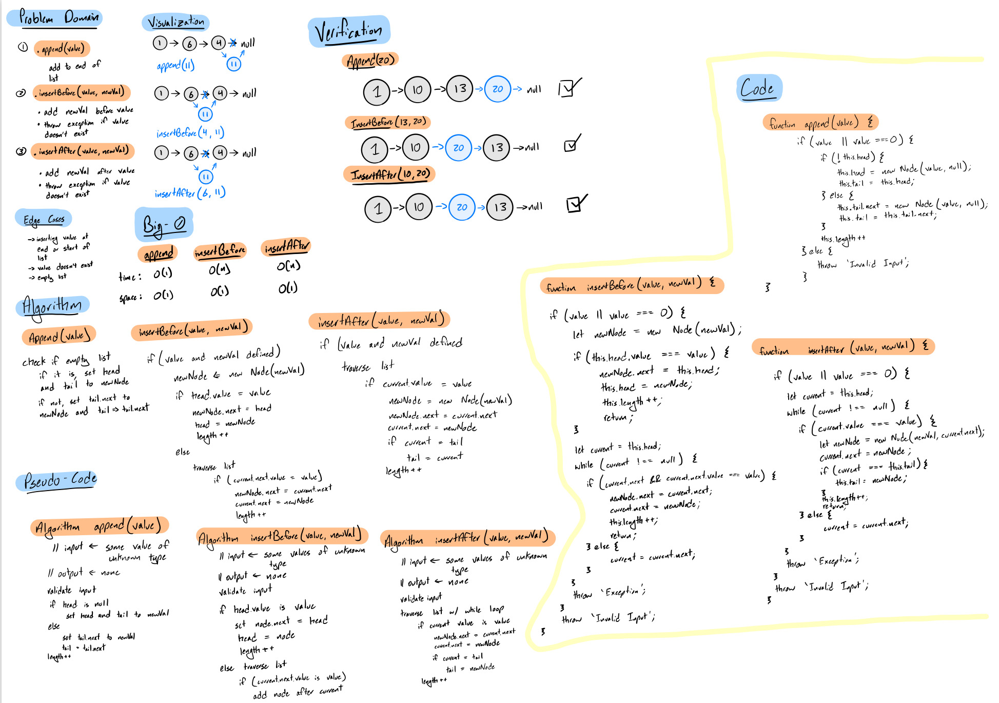
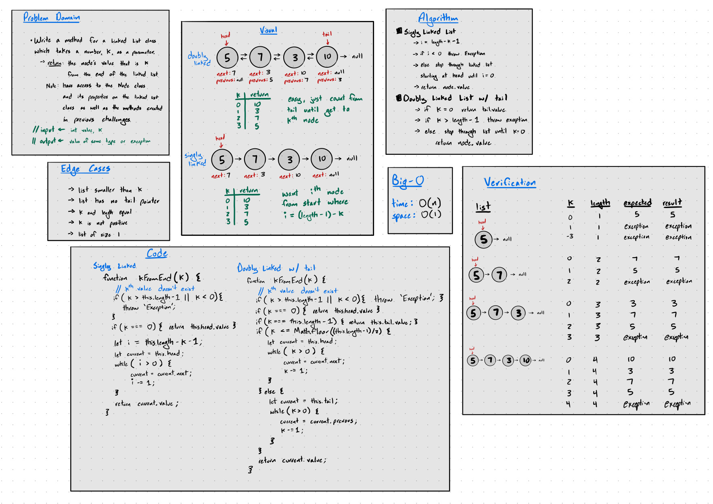

# Singly Linked List

A linked list is a sequence of `Nodes` that are connected/linked to each other. The most defining feature of a Linked List is that each `Node` references the next `Node` in the link.

In a singly linked list, each node has only a pointer to the next node in the list.

## Challenge
Create a `Node` class that has properties for the value stored in the `Node`, and a pointer to the next `Node`.

Create a LinkedList class, with methods:

 * `insert(value)`

    add passed in value to linked list at end of the list with O(1) time complexity.

 * `includes(value)`:

    check if list contains passed in value, return a boolean

 * `print()`:

    return an array containing all the `Node` values in the list

* `.append(value)`

    add value to the end of the list

* `.insertBefore(value, newVal)`

    add newVal before value, exception if value doesn't exist

* `.insertAfter(value, newVal)`

    add newVal after value, exception if value doesn't exist
    

## Approach & Efficiency

* `insert(value)`: 

    O(1) time complexity using a tail pointer for the last node in list

* `includes(value)`:

    O(n) time complexity, loop through list until value is found or return false at the end

* `print()`:

    O(n) time complexity, loop through all nodes in list and insert values into an array, return array at the end.

* `.append(value)`:

    O(1) time complexity, use tail pointer

* `.insertBefore(value, newVal)`:

    O(n) time complexity, worst case is we have to traverse entire list to look for value

* `.insertAfter(value, newVal)`:

    O(n) time complexity, worst case is we have to traverse entire list to look for value

## API
<!-- Description of each method publicly available to your Linked List -->

* `new LinkedList()`

    creates a new empty LinkedList, head and tail pointers equal to null

* `.insert(value)`

    inserts value as node at the end of the list, with its next pointer equal to null

* `.print()`

    returns the node values contained in the list as an array

* `.append(value)`

    add value to the end of the list

* `.insertBefore(value, newVal)`

    add newVal before value, exception if value doesn't exist

* `.insertAfter(value, newVal)`

    add newVal after value, exception if value doesn't exist

## Whiteboard

### Insertions

### Kth From End

