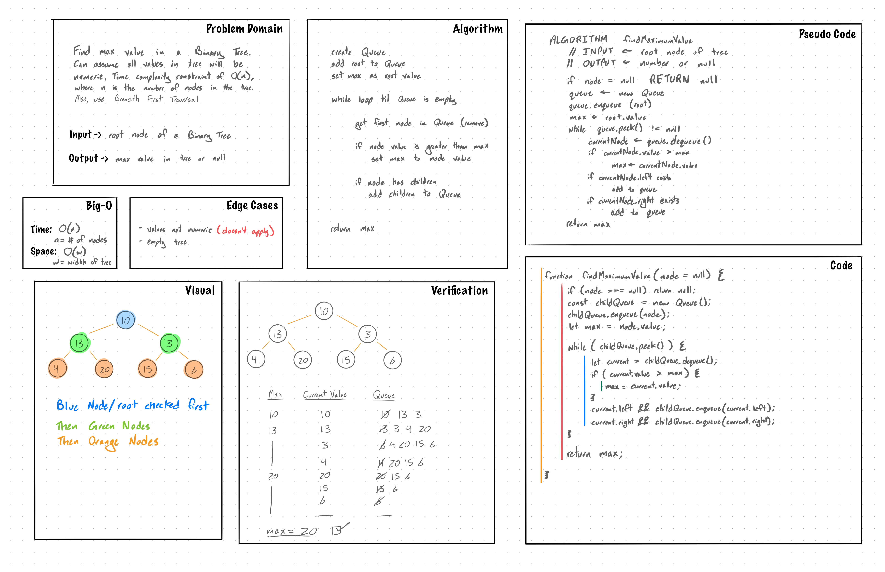

# Trees

A `tree` is a collection of entities called `nodes`. `Nodes` are connected by `edges`. 
Each `node` contains a `value` or `data`, and it may or may not have a `child node`.

## Challenge

- Create a Node class that has properties for:
  - the value stored in the node
  - the left child node
  - the right child node

- Create a BinaryTree class
  - Define a method for each of the depth first traversals which return an array of values, ordered appropriately.
    - `preOrder`
    - `inOrder`
    - `postOrder`
- Create a BinarySearchTree class
  - Define a method named `add` that accepts a value, and adds a new node with that value in the correct location 
  in the binary search tree.
  - Define a method named `contains` that accepts a value, and returns a boolean indicating whether or not the 
  value is in the tree at least once.

- Create a `findMaximumValue(root)` function that takes a binary tree as its only input and returns the max value in 
the tree. Solution must have time complexity equal to or less than O(n).

#### Stretch Goal

- Create a new branch called `k-ary tree`, and, using the resources available to you online, implement a k-ary 
tree, where each node can have any number of children.

## Approach & Efficiency

#### Binary Tree

- `findMaximumValue(root)`: use Breadth First Traversal to traverse binary tree with a max value tracker, if any node
 value is greater than the current max value, set max to the node value. Once all the nodes have been traversed, 
 return max value.
    
    `time: O(n)`, where n is the number of nodes in tree
    `space: O(w)`, where w is the width of the tree

- `preOrder(node, values)`: use recursion to traverse tree and add node values to passed in values array.

    1) add root values
    2) add values from left tree
    3) add values from right tree
    
    `time: O(n)`, where n is the number of nodes in tree
    `space: O(n)`, where n is the number of nodes in tree

- `inOrder(node, values)`: use recursion to traverse tree and add node values to passed in values array.

    1) add values from left tree of node
    2) add node value
    3) add values from right tree of node

    `time: O(n)`, 
    `space: O(n)`, 

- `postOrder(node, values)`: use recursion to traverse tree and add node values to passed in values array.

    1) add values from left tree of node
    2) add values from right tree of node
    3) add node value

    `time: O(n)`, 
    `space: O(n)`

#### Binary Search Tree

- `add(value)`: use a helper recusion method to traverse tree, smaller values to the left and greater/equal 
values to the right. no return

    `time: O(n)`, 
    `space: O(1)`

- `contains(value)`: recursive method to traverse list, move left if value less than, move right if value 
greater than. return true or false

    `time: O(n)`, 
    `space: O(n)`

## API

#### Binary Tree

`findMaximumValue(node) => Number or Null` 

- Returns the maximum value in binary tree, null if tree is empty
- Breadth First Traversal

`preOrder() => Array`:

- Returns all values in tree as an array of values in pre-order
- root, left, right

`inOrder() => Array`:

- Returns all values in tree as an array of values in in-order
- left, root, right

`postOrder() => Array`:

- Returns all values in tree as an array of values in post-order
- left, right, root

#### Binary Search Tree

All methods of Binary Tree

`add(value) => undefined`:

- adds value to BST

`contains(value) => boolean`:

- searches BST for value and returns true if value exists in tree, false otherwise

## Whiteboard Image

### Binary Tree
##### findMaximumValue(root)

